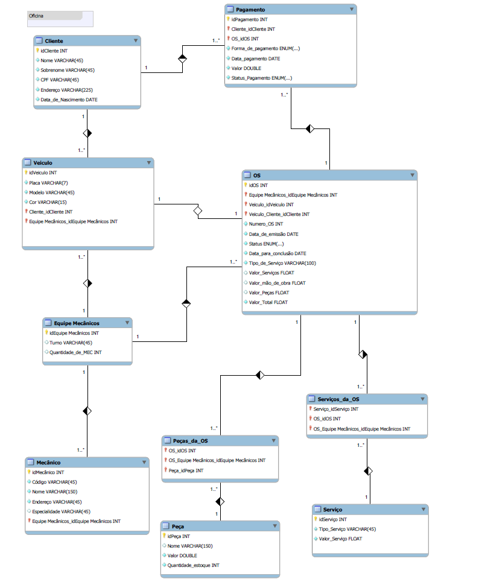

# 🛒 Projeto de Banco de Dados - Oficina

Este projeto consiste no design e implementação de um banco de dados relacional para um sistema de uma oficina. O objetivo é fornecer uma base robusta e escalável para operações comuns como cadastro de serviços, gerenciamento de clientes, os, pagamentos e mais.

---

## 📌 Funcionalidades do Banco de Dados

- Cadastro e autenticação de clientes
- Gerenciamento de peças e serviços
- Processamento de pedidos e pagamentos
- Controle de estoque

---

## 🧱 Modelo de Dados

### Principais Tabelas

- **cliente** – Dados de clientes cadastrados.
- **Veiculo** – Contém os veículos registrados para cada cliente.
- **Os** – Registra todos os serviços executados na oficina.
- **Equipe mecanicos** – Gerencia as equipes responsáveis pela execução dos serviços.
- **pagamento** – Informações de pagamento dos pedidos.
- **Servico** – Define tipos de serviços padrões com valores.


### Diagrama ER (Entity-Relationship)

> 


---

## ⚙️ Tecnologias Utilizadas

- **MySQL / PostgreSQL** (compatível com ambos)
- **SQL puro** (DDL e DML)
- Ferramentas recomendadas: MySQL Workbench

---

## ⚠️ Observação

Todos os dados utilizados neste projeto são fictícios e foram criados unicamente para fins acadêmicos.
Nenhuma informação pessoal, comercial ou sensível real está sendo usada ou representada.co

## 🚀 Como Executar

1. **Clone o repositório**
   ```bash
   git clone https://github.com/MarcosDutra-80/Desafio_BANCO_DE_DADOS---OFICINA.git
